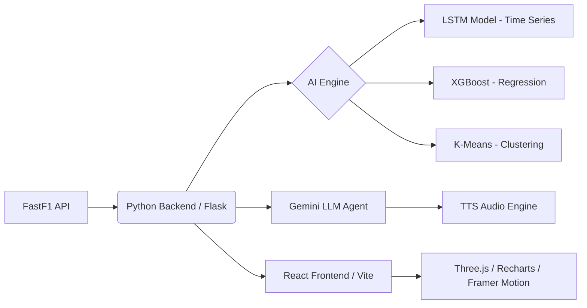

# 🏎️ F1 MISSION CONTROL: AI-Powered Race Strategy Platform

**A Next-Generation Decision Support System for Formula 1 Strategy, powered by Hybrid AI (LSTM + XGBoost) and Generative Agents.**


## 🚀 Project Overview

This is not just a dashboard; it is a comprehensive **Digital Twin** of an F1 Race Strategy environment. Unlike traditional static analysis tools, this project leverages **Deep Learning (LSTM)** for time-series forecasting, **XGBoost** for race simulations, and **Google Gemini** for natural language tactical briefings.

It transforms raw telemetry data into actionable intelligence, presented through a cinematic, high-performance **React** interface inspired by real-world Mission Control screens.

### 🌟 Key Capabilities (The "Novelty")

* **🧠 Hybrid AI Architecture**: Combines **LSTM Neural Networks** (for non-linear tire degradation prediction) with **XGBoost** (for recursive gap evolution forecasting).
* **🗣️ Generative AI Race Engineer**: A fully autonomous Voice Agent that analyzes telemetry JSON and speaks strategic commands using **Google Gemini 1.5 Pro** and Text-to-Speech.
* **🧊 3D & Spatial Visualization**: Interactive **WebGL 3D Tire Models** (React Three Fiber) and **Animated Track Maps** with real-time physics simulation.
* **🔬 Unsupervised Machine Learning**: Uses **K-Means Clustering** to segment track telemetry into "Performance DNA" (identifying mechanical vs. aerodynamic grip).

---

## 📸 System Modules

### 1. Mission Control (Live Dashboard)
The central hub featuring a **Neon-Glassmorphism UI**.
* **Live Battle Map**: SVG-based track visualization with real-time car interpolation and dominance coloring (Red vs. Teal).
* **Ghost Telemetry**: Speed trace overlays comparing driver inputs (Throttle/Brake) down to the meter.
* **LSTM Tire Health**: A "Sentient" tire model that predicts the exact lap a tire will hit the "Cliff."

### 2. Strategy Room (Simulation Engine)
* **XGBoost Projector**: Simulates the race 30 laps into the future to visualize "Undercut" and "Overcut" scenarios.
* **3D Tire Lab**: A rotating 3D model representing physical tire wear and surface temperature in real-time.

### 3. Telemetry Lab (Data Science)
* **Performance DNA Radar**: Uses K-Means clustering to categorize track sectors and compare drivers on 5 dimensions (Traction, Braking, Aero, etc.).
* **Recursive Gap Forecast**: Predicts "Laps to Catch" by feeding model outputs back into inputs recursively.

---

## 🛠️ Installation & Setup Guide

Follow these steps to clone and run the project locally.

### Prerequisites
* **Node.js** (v18 or higher)
* **Python** (v3.10 or higher)
* **Google Gemini API Key** (Get one [here](https://aistudio.google.com/app/apikey))

### Step 1: Clone the Repository

```bash
git clone [https://github.com/Rushil242/f1.git](https://github.com/Rushil242/f1.git)
cd f1
````

### Step 2: Backend Setup (The Brain)

1.  **Create a Virtual Environment:**

    ```bash
    # Windows
    python -m venv venv
    venv\Scripts\activate

    # Mac/Linux
    python3 -m venv venv
    source venv/bin/activate
    ```

2.  **Install Python Dependencies:**

    ```bash
    pip install -r requirements.txt
    ```

3.  **Train the AI Models:**
    *Crucial Step:* You must train the LSTM and XGBoost models before running the server.

    ```bash
    python src/model_training.py
    ```

    *Wait for the message: "All Models Trained Successfully"*

4.  **Configure API Key:**
    Open `backend/server.py` and replace the placeholder with your key:

    ```python
    GEMINI_API_KEY = "YOUR_ACTUAL_GEMINI_KEY_HERE"
    ```

5.  **Start the Backend Server:**

    ```bash
    cd backend
    python server.py
    ```

    *The server will start on `http://127.0.0.1:5000`*

### Step 3: Frontend Setup (The Face)

1.  **Open a new terminal** (keep the backend running).

2.  **Navigate to the frontend folder:**

    ```bash
    cd frontend
    ```

3.  **Install Node Packages:**

    ```bash
    npm install
    ```

4.  **Start the React App:**

    ```bash
    npm run dev
    ```

    *The app will launch at `http://localhost:5173`*

-----

## 🏗️ Technical Architecture

The system follows a decoupled **Microservices** pattern:



-----

## 🔧 ML & Algorithms Deep Dive

### 1\. Deep Learning: Tire "Sentience" (LSTM)

  * **Why:** Standard regression fails to capture the "Cliff" (sudden loss of grip).
  * **Model:** Long Short-Term Memory (LSTM) Network built with **TensorFlow/Keras**.
  * **Input:** Sliding window of last 5 laps (LapTime, FuelLoad, TireAge).
  * **Output:** Predicted Lap Time for $t+1$. If prediction deviates \>1.5s from trend, a "CRITICAL" alert is triggered.

### 2\. Predictive Analytics: The "Catch" Predictor (XGBoost)

  * **Why:** To answer "Will Max catch Charles?"
  * **Technique:** **Recursive Forecasting**. The model predicts Lap 26 based on Lap 25, then uses that prediction to predict Lap 27, and so on for 15 steps.
  * **Feature:** Accounts for non-linear fuel burn and compound degradation curves.

### 3\. Diagnostic Analytics: Performance DNA (K-Means)

  * **Why:** To remove human bias from "Slow" vs "Fast" corners.
  * **Technique:** Unsupervised **K-Means Clustering** on telemetry speed data.
  * **Result:** Automatically groups track segments into *Cluster 0 (Traction Zones)*, *Cluster 1 (Aero Corners)*, and *Cluster 2 (Straights)* for granular analysis.

-----

## 📁 Project Structure

```
f1-mission-control/
├── backend/
│   ├── server.py             # Flask API Gateway
│   ├── analysis_engine.py    # Core Logic (FastF1, Math, Clustering)
│   ├── voice_agent.py        # Gemini LLM + TTS Wrapper
│   └── audio_cache/          # Generated MP3 briefings
│
├── frontend/
│   ├── src/
│   │   ├── components/       # 3D Tire, Track Map, Charts
│   │   ├── pages/            # Dashboard, Strategy, Telemetry Pages
│   │   ├── assets/           # Cinematic images
│   │   └── App.jsx           # Router & Layout
│   └── tailwind.config.js    # Neon Theme Configuration
│
├── data/
│   ├── models/               # Saved LSTM (.keras) & XGBoost (.pkl) models
│   └── processed/            # Cleaned CSVs
│
└── src/                      # AI Training Pipeline
    ├── model_training.py     # The ML Training Script
    └── data_preprocessing.py # Feature Engineering
```

-----

## 🤝 Future Roadmap

  * [ ] **WebSockets:** Replace polling with real-time socket connections for live race streams.
  * [ ] **Computer Vision:** Analyze pit stop videos to predict errors using OpenCV.
  * [ ] **Multi-Car Simulation:** Simulate the entire grid of 20 cars using Agent-Based Modeling.

